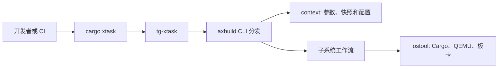

# `cargo xtask` 使用指南

`cargo xtask` 是 TGOSKits 的统一宿主机入口。它将 ArceOS、StarryOS、Axvisor、内核测试、镜像和远程板卡等工作流收敛到同一套命令中。日常开发应优先使用它，而不是手工拼接 `cargo build`、QEMU、rootfs 和交叉编译器参数；这样本地执行路径能更接近 CI。

本页用于选择正确的命令和配置边界。各子系统的构建、运行和测试细节见 [命令参考](./commands)、[参数与配置](./configuration) 及对应的子系统页面。

## 快速开始

在工作区根目录执行下列命令确认入口可用，并按需逐层查看帮助：

```bash
cargo xtask --help
cargo xtask arceos --help
cargo xtask arceos qemu --help
```

`.cargo/config.toml` 定义了几个等价的 Cargo 别名。因此下列写法等价：

```bash
cargo xtask arceos qemu --package arceos-helloworld --arch riscv64
cargo arceos qemu --package arceos-helloworld --arch riscv64
```

文档、脚本和 CI 中建议使用完整的 `cargo xtask ...` 写法，便于读者明确这是工作区提供的命令，而不是 Cargo 内置子命令。

## 命令模型

命令按“工作区通用能力”和“三个系统能力”划分：

| 命令 | 用途 | 适用场景 |
| --- | --- | --- |
| `cargo xtask test` | 运行 std 白名单中的宿主机测试 | 修改可在 host 上测试的基础 crate 或工具 crate |
| `cargo xtask ktest qemu/board` | 运行内核 `axtest` 目标 | 验证特定内核测试 target |
| `cargo xtask clippy` | 按项目定义的 feature 和 target 矩阵运行 Clippy | 提交前检查 Rust 改动 |
| `cargo xtask sync-lint` | 检查可疑的 `Relaxed` 原子同步 | 修改并发、锁或原子协议后 |
| `cargo xtask spin-lint` | 确认未解析外部 `spin` crate | 依赖或锁实现调整后 |
| `cargo xtask image` | 列出、下载、校验和扩容 TGOS 镜像 | rootfs 或 guest 镜像管理 |
| `cargo xtask board` | 分配、连接和配置远程开发板 | 人工串口调试或板卡准备 |
| `cargo xtask backtrace symbolize` | 将运行日志中的原始地址符号化 | QEMU 或板卡出现 trap/panic 后 |
| `cargo xtask axloader` | 构建和测试 axloader | 修改启动加载器 |
| `cargo xtask arceos ...` | 构建、运行和测试 ArceOS app | ArceOS 开发 |
| `cargo xtask starry ...` | 构建、运行、测试和剖析 StarryOS | StarryOS 开发 |
| `cargo xtask axvisor ...` | 构建、运行和测试 Axvisor | 虚拟化开发 |

`cargo xtask test` 不是 `cargo test --workspace`，也没有 `std` 子命令。它只读取 `scripts/test/std_crates.csv` 中明确维护的包，并依次执行 `cargo test -p <package>`。工作区含有大量 `#![no_std]` 内核 crate，不能把该命令当作全工作区测试替代品。

## 推荐开发闭环

大多数改动可按下面顺序验证：

1. 用 `cargo xtask clippy --package <package>` 检查直接修改的 crate。
2. 运行最小、确定的宿主机测试或内核测试。
3. 用对应系统的 `qemu` 命令验证实际启动路径。
4. 改动影响跨架构、启动、驱动或用户态接口时，运行对应系统的 `test qemu --arch <arch>`。
5. 出现运行时故障时保留日志，并用 `backtrace symbolize` 定位地址。

例如，修改了 ArceOS 运行时组件后，可先执行：

```bash
cargo xtask clippy --package ax-runtime
cargo xtask arceos test qemu --arch riscv64
```

测试集会使用专门的测试配置，不会写入日常开发快照；这比只运行曾成功过的短命令更适合回归验证。

## 配置如何生效

`axbuild` 为 `tg-xtask` 提供配置解析、Cargo 调用和 QEMU 编排。系统命令接收的常用参数如下：

| 参数 | 含义 |
| --- | --- |
| `--arch <ARCH>` | 使用架构名选择 target，如 `riscv64` |
| `--target <TRIPLE>` | 直接指定 Rust target triple |
| `--config <PATH>` | 指定 Build Info TOML，控制 features、环境变量和构建行为 |
| `--qemu-config <PATH>` | 指定 QEMU TOML，控制 QEMU 参数、磁盘和网络设备 |
| `--rootfs <IMAGE>` | 覆盖自动获取的 rootfs 或 guest 镜像 |
| `--smp <CPUS>` | 指定 CPU 数量 |
| `--debug` | 使用 debug 构建 |

`--arch` 与 `--target` 可以二选一；同时指定时必须匹配：

| `--arch` | 对应 target |
| --- | --- |
| `aarch64` | `aarch64-unknown-none-softfloat` |
| `x86_64` | `x86_64-unknown-none` |
| `riscv64` | `riscv64gc-unknown-none-elf` |
| `loongarch64` | `loongarch64-unknown-none-softfloat` |

### Snapshot 与可复现命令

执行 ArceOS、StarryOS 或 Axvisor 命令时，`axbuild` 会读取 `tmp/axbuild/.arceos.toml`、`.starry.toml` 或 `.axvisor.toml`，将其中保存的最近一次参数作为缺省值。它适合本地反复调试：

```bash
cargo xtask arceos build --package arceos-helloworld --arch riscv64
cargo xtask arceos qemu
```

但快照是工作目录状态，不是项目配置。它可能来自另一个 app、架构或 QEMU 场景。因此文档、问题复现命令、脚本和 CI 应显式传入关键参数，尤其是 `--package`、`--target`、`--config` 和 `--qemu-config`。如需避免本次命令改写快照，可设置：

```bash
AXBUILD_NO_SNAPSHOT=1 cargo xtask arceos qemu ...
```

该环境变量只禁止写回，已有快照仍会被读取；要完全摆脱历史状态，应显式给出关键参数，或清理相应的 `tmp/axbuild/.<os>.toml`。

### Build Info、QEMU 配置与运行时资产

Build Info 解决“如何编译”，QEMU TOML 解决“如何运行”：

- Build Info 的默认位置为 `tmp/axbuild/config/<package>/build-<target>.toml`，其中的 `features`、`env`、日志级别和 CPU 配置会传递给构建过程。
- `--config` 可指定仓库内的确定配置，适合示例、板卡和 CI 场景。
- QEMU TOML 可声明磁盘、网络和启动参数。执行 `qemu` 时，工具会为所需的运行时磁盘准备对应资产。
- `--rootfs` 适合使用已有本地镜像；不指定时，支持 rootfs 的系统会按其规则自动准备镜像。

不要把 QEMU 参数、Cargo feature 或交叉编译器环境变量直接散落在 shell 脚本中。应先判断它们属于 Build Info、QEMU TOML 还是镜像配置，再放到对应位置。

## ArceOS

ArceOS 以 app crate 为构建单位，`build`、`qemu`、`uboot` 和 `board` 都需要 `--package`，除非快照中已经有可复用的包名。

```bash
# 只构建 app
cargo xtask arceos build --package arceos-helloworld --arch riscv64

# 构建并在 QEMU 中运行
cargo xtask arceos qemu --package arceos-helloworld --arch riscv64

# 列出并运行测试套件
cargo xtask arceos test qemu --arch riscv64 --list
cargo xtask arceos test qemu --arch riscv64 --test-group rust --test-case all
```

RISC-V HelloWorld 的可复现启动命令应显式选择仓库提供的构建与 QEMU 配置：

```bash
cargo xtask arceos qemu \
  --package arceos-helloworld \
  --target riscv64gc-unknown-none-elf \
  --config apps/arceos/build-riscv64gc-unknown-none-elf.toml \
  --qemu-config apps/arceos/helloworld/qemu-riscv64.toml
```

上例中 Build Info 决定 ArceOS 所需的 feature 组合，QEMU 配置决定 `qemu-system-riscv64` 的设备与运行时磁盘。仅写 `--target` 不能替代这两份配置；短命令是否能成功取决于默认值与本地快照，不能作为可移植的验证步骤。

ArceOS 的其他入口包括：

- `arceos defconfig <board>`：生成动态板卡默认配置；用 `arceos config ls` 查看名称。
- `arceos uboot`：构建后通过 U-Boot 启动，使用 `--uboot-config`。
- `arceos board`：构建并部署到远程板卡，使用 `--board-config`、`--board-type`、`--server` 和 `--port`。

详细行为见 [ArceOS 概述](./arceos/overview)、[构建](./arceos/build)、[运行](./arceos/runtime) 和 [测试](./arceos/test)。

## StarryOS

StarryOS 构建的是整体系统，不使用 ArceOS 的 `--package` 模型。其常用路径为：

```bash
# 构建并启动默认系统；首次需要时自动准备 rootfs
cargo xtask starry qemu --arch riscv64

# 单独准备或检查默认 rootfs
cargo xtask starry rootfs --arch riscv64

# 浏览和执行测试
cargo xtask starry test qemu --arch riscv64 --list
cargo xtask starry test qemu --arch riscv64 --test-case <case>

# 浏览并启动 apps/starry/ 下的独立应用
cargo xtask starry app list
cargo xtask starry app qemu --help
```

StarryOS 还提供：

- `starry perf`：以 qperf 对 QEMU 启动或指定工作负载做性能剖析。
- `starry kmod build`：构建可加载内核模块。
- `starry quick-start`：常见 QEMU 和 Orange Pi 工作流的便捷入口；新脚本应优先使用明确的 `build`、`qemu`、`test` 或 `board` 命令。
- `starry uboot`、`starry board`：U-Boot 和远程板卡运行路径。

详情见 [StarryOS 概述](./starry/overview)、[应用运行](./starry/app)、[rootfs](./starry/rootfs) 和 [性能剖析](./starry/perf)。

## Axvisor 与 axloader

Axvisor 的运行请求除通用构建参数外，还可以通过 `--vmconfigs <PATH>` 指定 guest VM 配置：

```bash
# 发现并运行特定架构的虚拟化测试
cargo xtask axvisor test qemu --arch aarch64 --list
cargo xtask axvisor test qemu --arch aarch64 --test-case <case>

# 根据 Build Info、QEMU 配置和 VM 配置启动 Axvisor
cargo xtask axvisor qemu \
  --arch aarch64 \
  --config <build-info.toml> \
  --qemu-config <qemu.toml> \
  --vmconfigs <vmconfig.toml>

# 构建或运行 axloader 自己的测试套件
cargo xtask axloader build --help
cargo xtask axloader test qemu --help
```

Axvisor 还支持 `uboot`、`board`、`defconfig` 和 `config ls`。不同板卡、guest 镜像与虚拟化后端具有额外约束，使用前应阅读 [Axvisor 概述](./axvisor/overview) 与 [运行](./axvisor/runtime)。

## 工作区辅助工具

### 静态检查

```bash
# 指定 crate，日常改动的首选检查
cargo xtask clippy --package ax-runtime

# 检查相对某个 git ref 受影响的包
cargo xtask clippy --since origin/main

# 检查全部工作区包，耗时较长
cargo xtask clippy --all

# 并发同步与依赖卫生检查
cargo xtask sync-lint --since origin/main
cargo xtask spin-lint
```

`clippy` 会按包的 target 与 feature 组合扩展检查，而不是简单转发一次 `cargo clippy`。因此在改动 OS、平台或驱动 crate 后，应使用这一入口。详情见 [Clippy 检查](./clippy)。

### 镜像与 rootfs

```bash
# 查看镜像注册表内容
cargo xtask image ls

# 拉取适合 RISC-V 的默认镜像并校验
cargo xtask image pull --arch riscv64

# 校验或扩容本地镜像
cargo xtask image check /path/to/rootfs.img
cargo xtask image resize /path/to/rootfs.img --size-mib 4096
```

镜像本地存储、注册表覆盖及自动同步策略见 [镜像管理](./image)。

### 远程板卡

```bash
# 查询可用的远程板卡类型
cargo xtask board ls

# 配置默认 ostool-server
cargo xtask board config

# 分配板卡并连接串口
cargo xtask board connect --board-type <board>
```

顶层 `board` 用于分配和连接板卡；`cargo xtask arceos|starry|axvisor board` 则会执行构建、部署和串口结果收集。两者用途不同，详见 [板卡管理](./board)。

### Backtrace 符号化

当运行日志包含 `BACKTRACE_BEGIN`、`BT ...`、`BACKTRACE_END` 块时，可在 host 上用带调试信息的 ELF 将地址还原为符号：

```bash
cargo xtask backtrace symbolize \
  --elf target/<target>/<profile>/<binary> \
  --log qemu.log
```

ArceOS Rust QEMU 测试默认会尝试完成这一步；可用 `--no-symbolize` 跳过，或用 `--keep-qemu-log` 保存成功后的捕获日志。离线参数说明见 [Backtrace 符号化](./backtrace)。

## 实现与扩展

通过`cargo xtask`的CLI工具，把整个配置编译运行的过程进行分层，即把“用户命令、项目规则、通用执行、外部工具”分开，避免每个 OS 或 app 重复维护构建脚本。 分层关系是：


```text
cargo xtask
  -> tg-xtask
  -> axbuild
  -> ostool
  -> Cargo / QEMU / U-Boot / ostool-server
```

| 层 | 定位 | 主要职责 |
|---|---|---|
| `cargo xtask` | Cargo 调用入口 | 由 `.cargo/config.toml` 的 alias 将命令转为运行 `tg-xtask`。 |
| `tg-xtask` | 极薄的可执行程序 | 提供统一命令入口，建立宿主侧 Tokio 运行时，调用 `axbuild::run()`，将错误转换为进程退出码。 |
| `axbuild` | TGOSKits 工作流层 | 解析命令，处理 TGOSKits 的系统特定逻辑，合并 CLI、Snapshot、Build Info，选择架构、feature、应用、测试和运行配置，并编排 ArceOS、StarryOS、Axvisor 的不同流程。 |
| `ostool` | 通用工具执行层 | ostool 是 TGOSKits 依赖的一个宿主机 Rust crate，用于封装底层执行动作，不是用户通常直接执行的 cargo 子命令。将编排结果转成实际的 Cargo 调用、QEMU/U-Boot 启动、镜像/产物准备与远程板卡请求。如要修改通用的 Cargo/QEMU/板卡执行机制时，需要关注 ostool 接口。 |
| 外部工具或服务 | 最终执行者 | Cargo 编译 Rust；QEMU 模拟硬件；U-Boot 执行板端引导；`ostool-server` 管理远程物理板卡。 |


  


以 RISC-V ArceOS HelloWorld 为例：

1. 用户执行如下命令·cargo xtask arceos qemu ...`命令：
```
   cargo xtask arceos qemu \
  --package arceos-helloworld \
  --target riscv64gc-unknown-none-elf \
  --config apps/arceos/build-riscv64gc-unknown-none-elf.toml \
  --qemu-config apps/arceos/helloworld/qemu-riscv64.toml
```
2. Cargo 根据 alias 启动 `tg-xtask`。
3. `tg-xtask` 把控制权交给 `axbuild`。
4. `axbuild` 读取 `--package`、`--target`、Build Info 与 QEMU TOML，确定 Cargo feature、环境变量、目标文件和 QEMU 设备配置。
5. `axbuild` 调用 `ostool`：先构建产物，再准备磁盘等运行时资产，最后执行 `qemu-system-riscv64 ...` 命令。
```
qemu-system-riscv64 -machine virt -cpu rv64 -m 512M -smp 1 -nographic -device virtio-blk-pci,drive=disk0 -drive id=disk0,if=none,format=raw,file=./tgoskits/tmp/axbuild/runtime-assets/apps/arceos/helloworld/disk.img -device virtio-net-pci,netdev=net0 -netdev user,id=net0 -serial mon:stdio -kernel ./tgoskits/target/riscv64gc-unknown-linux-musl/release/arceos-helloworld.bin
```
6. QEMU 加载 OpenSBI 与 ArceOS 二进制，串口输出回到终端。

这种分层的价值是：

- 用户只需记住统一的 `cargo xtask` 接口。
- ArceOS、StarryOS、Axvisor 共享参数解析、镜像、QEMU、板卡和测试基础设施。
- TGOSKits 特有规则留在 `axbuild`，例如动态平台、测试用例发现、Starry rootfs、Axvisor VM 配置。
- 通用的外部进程和板卡交互留在 `ostool`，便于复用，也避免 OS 工作流直接依赖 QEMU 命令细节。

`xtask/src/main.rs` 只负责建立 Tokio 主入口并调用 `axbuild::run()`。顶层命令由 `scripts/axbuild/src/lib.rs` 的 Clap `Commands` 枚举解析，再分发到 `arceos`、`starry`、`axvisor`、`image`、`board` 等模块。`context/` 负责合并 CLI 参数、Snapshot 和默认值，`ostool` 承担最终的 Cargo 与 QEMU 执行。



因此扩展命令时应按职责放置：

- 新增根工作区通用命令：在 `scripts/axbuild/src/lib.rs` 注册并放入对应的通用模块。
- 新增 ArceOS、StarryOS 或 Axvisor 行为：放在各自的 `scripts/axbuild/src/<system>/` 下，复用已有请求解析和 Snapshot 逻辑。
- 修改 target 映射、Build Info 或 Snapshot 合并：修改 `scripts/axbuild/src/context/`，并补充该层测试。
- 修改 Cargo/QEMU 的底层执行机制：优先检查 `ostool` 接口与 `axbuild` 调用点，不应把实现堆进 `xtask/src/main.rs`。

新增或修改命令后，至少验证对应的 `--help`、参数解析测试和最小真实执行路径。对涉及构建或运行语义的改动，应执行目标 crate 的 `cargo xtask clippy --package <crate>`，并运行受影响系统的 QEMU 或测试套件。


## 常见问题

| 现象 | 优先检查 |
| --- | --- |
| 命令没有指定 package 却开始构建错误目标 | 查看 `tmp/axbuild/.arceos.toml`，并显式传入 `--package` |
| QEMU 启动参数或设备不符合预期 | 显式传入 `--qemu-config`，检查 TOML 与运行日志中的最终 QEMU 命令 |
| feature、驱动或日志行为不符合预期 | 使用 `--config` 锁定 Build Info，检查配置中的 `features` 和 `env` |
| `--arch` 与 `--target` 报冲突 | 只提供一个，或使用映射表中的正确组合 |
| rootfs 下载或镜像定位失败 | 用 `cargo xtask image ls`、`image pull` 检查镜像和本地存储配置 |
| QEMU trap/panic 只有地址 | 保存日志后执行 `cargo xtask backtrace symbolize` |
| 不清楚参数是否受支持 | 运行精确层级的 `cargo xtask <path> --help`，以当前构建的 CLI 输出为准 |

对于可复现问题，请附上完整命令、Build Info、QEMU TOML、目标架构、QEMU 版本和完整串口日志。这样可以排除 Snapshot 或本地镜像状态带来的差异。
